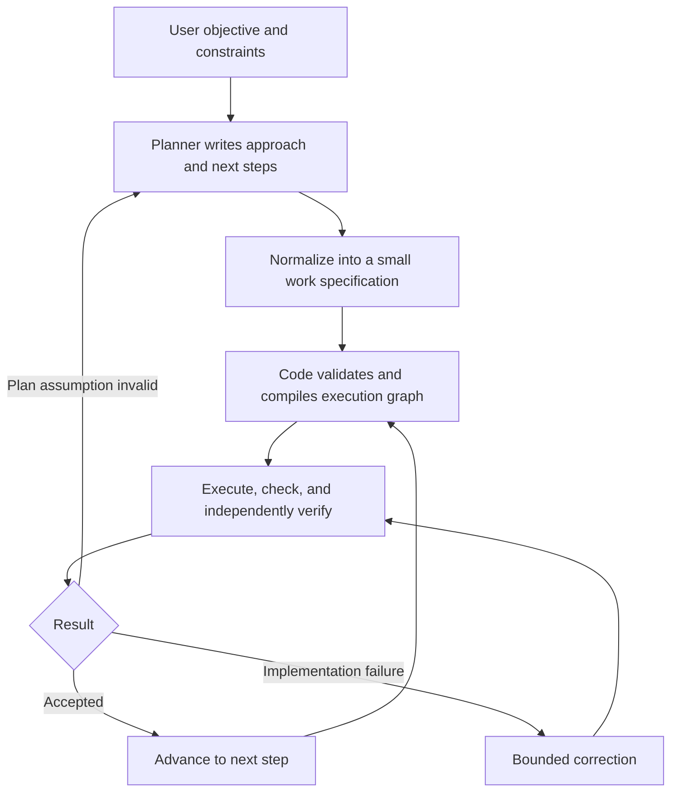

# Simplifying orchestration for smaller models

The system currently asks the planner to be both an engineer and an operator of the orchestration engine. Those are competing demands. For a small model, producing a valid execution graph can become the main task, while deciding what work should happen becomes secondary.

The direction to pursue is: **agents describe work and make decisions; code constructs and maintains the execution machinery.** Keep the graph’s capabilities, but move it below the interface agents normally use.

## Challenges in the current system

This requires more than reducing tool-call count.

The current planner prompt requires the agent to understand graph positions, accepted patches, rejection feedback, evidence bindings, failure continuations, snapshot rules, and when a patch submission permits a separate completion submission. It also includes templates, examples, and allowed operations. That is a substantial protocol to navigate before doing useful planning. See [planner prompt construction](../src/orchestrator/graph_runtime/prompts.py).

The macros already attempt to simplify this, but their interface still exposes the execution representation. For example, corrective work involves exact failed-record IDs, source-node IDs, and snapshot selection; implementation batches involve schema versions, plan-verification sources, and planning horizons. These are mostly facts the orchestrator already knows. See [macro arguments](../src/orchestrator/graph/macros.py).

The recorded results reinforce the concern, with qualifications: the August 28 legacy arm completed using about 2.1 million recorded tokens, while the two graph arms failed using about 8.6 and 10.8 million. Different model assignments and runtime defects prevent attributing that difference solely to planner overhead. Also, token totals do not measure how much “thinking” went into orchestration. But this is strong evidence that the extra machinery was not paying for itself in that trial. See the [evaluation record](dynamic-graph/dogfood-reliable-plan-evaluation.md).

## Description-first planning

A description-first approach is promising, provided the description becomes a preserved source artifact rather than something repeatedly paraphrased away.

The important boundary is between **interpreting intent**, which may need a model, and **constructing execution**, which should normally be deterministic.

| Decision or responsibility | Natural owner |
|---|---|
| What outcome matters? What approach makes sense? | Planner |
| What is uncertain and needs investigation? | Planner or discovery worker |
| Extract requirements from a description | Model, with source references and review |
| Decide whether a proposed test actually checks the requirement | Engineering judgment and independent verification |
| Allocate IDs, bind records, construct nodes and edges | Code |
| Add standard verification and failure paths | Code using an execution policy |
| Manage snapshots, retries, leases, and stale submissions | Code |
| Decide whether failures invalidate the approach | Model, when evidence warrants it |
| Enforce required evidence before completion | Code |

Creating requirements and designing checks are not deterministic just because they occur in separate steps. They remain interpretation tasks. Node creation, on the other hand, generally should not be.

## A small work language

Give the planner a small work language, with room for ordinary prose. A planner might produce:

> First inspect how run cancellation reaches the executor. Then make cancellation release resources exactly once, preserving existing pause behavior. Verify cancellation during active work and repeated cancellation. If ownership is split across components, investigate that before implementation.

A downstream work specification could contain only:

- Outcome.
- Relevant source requirements.
- Inputs or earlier steps it depends on.
- Scope and constraints.
- Expected result.
- Acceptance obligations.
- Open questions.

The planner should not need to name a verifier node, choose a candidate ID, construct a failure edge, or repeat a schema version.

The compiler can expand that specification into the full contract the runtime needs. Useful foundations already exist: a [pure routine-to-graph compiler](../src/orchestrator/graph/compiler.py), macro expansion, and validated semantic artifacts. This can be an additional authoring layer rather than a replacement execution engine.

Preserve the original user request, the plan, and the extracted work specification as distinct, versioned artifacts. An extracted requirement should say where it came from. An inferred requirement should be marked as an inference. Otherwise each stage can quietly distort the previous one, and the final verifier can approve work against a diluted version of the original request.

## Making work suitable for smaller models

Smaller models need fewer simultaneous decisions, not necessarily more agents or smaller tasks. Optimize each invocation around one coherent judgment:

- A discovery worker answers a specific uncertainty.
- A planner selects an approach and meaningful stages.
- An implementer receives one bounded outcome plus the relevant surrounding constraints.
- A verifier evaluates that outcome and its interactions with accepted behavior.
- A replanner receives evidence that the current approach needs to change.

Splitting everything into tiny stages can make matters worse. Each boundary adds context loading, interpretation, handoff, and another opportunity to lose meaning. A requirement extractor, check author, dependency extractor, and node author might cost more than a planner producing one lightly structured document.

Start with one planning call and deterministic compilation. Add another model stage only where measured errors justify it.

Preserve broader verification. An earlier comparison documented narrow per-chunk validators missing interaction bugs despite many iterations. That experiment had harness and fidelity caveats, but it identifies a real design hazard: making implementation locally manageable must not make acceptance locally blind. See the [comparison record](graph-approach/complete/big-comparison/results.md).

## Adaptation without repeated graph design

Most execution can follow a standard policy: perform work, run checks, independently verify, correct bounded failures, then advance. Invoke planning again when evidence changes the problem:

- A dependency or assumption is wrong.
- The scope must change.
- Several corrections fail for the same reason.
- There is a genuine choice between approaches.
- New evidence requires additional work.

A worker could return “needs investigation” with the question and supporting evidence. The orchestrator creates the investigation stage and returns its answer. A verifier could return “implementation failure” or “plan assumption invalid,” with reasons. Code routes the result through a validated policy.

Retain flexibility by making semantic requests extensible while keeping execution mechanics standardized. Support custom artifact schemas, dependencies, optional checks, branches, and bounded repetition. Expose advanced graph construction through a separate interface when an unusual workflow actually needs it.

There is an unavoidable boundary: code cannot automatically compile arbitrary prose into every conceivable workflow. An unsupported arrangement should become an explicit unresolved request, not silently fall back to a generic worker.

## Making unusual workflows easier to experiment with

Some workflow semantics already sit inside graph validation. For example, the validator contains rules for discovery, plan verification, effectful batches, and reliable-plan topology. Those rules address real failures, but they also mean changing the arrangement can require changes across prompts, tools, validation, and runtime behavior. See [patch validation](../src/orchestrator/graph/patch_validator.py).

Distinguish two kinds of rule:

- **Execution invariants:** valid provenance, authorized writes, coherent snapshots, valid dependencies, durable recovery. These remain mandatory.
- **Workflow policy:** whether discovery needs a separate verifier, when planning repeats, how many corrections precede replanning, whether requirements extraction is separate. These should be versioned and replaceable.

Do not remove the safeguards to enable experiments. Make alternative policies responsible for producing execution structures that satisfy the same safeguards. Some guarantees will remain conditional: a workflow promising independently verified planning must enforce that promise.

That separation would let a description-first arrangement be tested without teaching the kernel a new universal sequence every time.

## Proposed first experiment

Keep the current execution engine and introduce one new entry point: submit a work plan. It accepts a compact specification, binds runtime metadata itself, and compiles a complete execution region atomically. Validation feedback asks about missing meaning—“What must this step establish?”—rather than asking the planner to repair record wiring.

Compare:

1. Current graph-macro planning.
2. One lightly structured planning output, compiled by code.
3. Prose planning followed by a separate normalization call.

First feed equivalent plans through each interface to isolate orchestration overhead. Then run end-to-end trials to measure whether the planning approach itself changes quality. Use the same user-selected models, task inputs, acceptance criteria, and execution budgets across comparable arms, with repeated trials.

Measure correctness and successful completion first, then orchestration calls, rejected submissions, context size, latency, cost, human intervention, and preservation of requirements. Include failures and replanning cases; easy successful runs will not test the boundary that matters.

The strongest recommendation is to make the **complete work contract an orchestrator-produced object**. The agent supplies the substantive decisions needed to build it. That preserves the rigor already invested in the system while giving small models substantially less system operation to perform.
