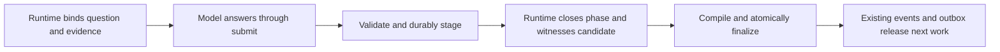

# Model decisions with runtime-owned consequences

Status: proposed architecture, prepared September 11, 2026. Implementation is
sequenced in [implementation.md](implementation.md). The exact proposed answer,
binding and lifecycle contracts are fixed in [contracts.md](contracts.md).

## Intent and scope

For each agent step, identify the uncertainty that requires judgment, its bound
evidence, and the answer or work product needed. Give the model that assignment.
Have code derive and execute the mechanical consequences. This applies to
partially mechanical steps as well as entirely mechanical ones.

The first supported implementation is the reliable-plan graph path, including
initial planning, discovery, successor decisions, correction and verification.
Use the same output boundary for ordinary authoring steps and existing typed
appeal, oversight and recovery outputs. General graph authoring and historical
legacy execution retain their explicit contracts during rollout. Do not
silently reinterpret an arbitrary custom routine as the reliable-plan profile.

The model may investigate evidence and author code or semantic artifacts. It
does not need to manufacture a graph patch, reproduce known requirements,
select lease or candidate identities, commit a candidate, run mandatory checks
to prove completion, or call a second tool to finish an already supplied answer.
Optional exploratory commands remain useful, but they do not become acceptance
receipts merely because the model says they passed.

## Existing machinery to keep

| Owner | Existing seam and intended use |
|---|---|
| `graph/contracts.py` | Node kinds, roles, ports, authority and fulfillment contracts. Extend this ownership; avoid another independent node registry. |
| `graph/semantic_artifacts.py`, `models.py` | Exact-version semantic schema declarations, canonical records and validation. Retain the generic artifact envelope for domain content. |
| `graph/macros.py` | Pure semantic-to-graph expansion already creates complete regions, exact bindings and finalization shape. Extract/reuse its logic. |
| `graph/commands/boundary.py` | Submission staging validates effects without publishing them; witnessed finalization publishes accepted effects. This is the transaction boundary. |
| `graph_runtime/dispatch.py` | Builds submission contracts from bound declarations, captures candidate boundaries, resolves CAS payloads and owns runner lifecycle. |
| `runners/types.py`, `runners/submission.py` | `SubmissionContract`, `SubmissionOutputContract`, canonical submit schema and prompt rendering. Reuse the existing `SubmitCallback`. |
| `graph_runtime/submission_gate.py`, `recovery.py` | Command execution receipts, exact candidate validation, restoration and ownership draining. |
| `graph/reliable_plan_evaluation.py` | Typed evaluation manifests, qualification identity, correctness and usage results. Extend this rather than invent another evaluation service. |

Current incompatibilities are concrete. Planner schemas still require
`patch_id` and `base_graph_position`; prompts require an accepted construction
followed by plain submit. The routine's implementation-plan schema represents
checks as strings, while the constructor expects command-binding/definition
objects. A successor re-expresses facts already present in the verified plan.
Verifier grading is accumulated separately from submission. These boundaries
should become typed translations owned by code.

## One answer channel

Use the existing `submit(outputs=...)` call as the answer channel. Its name can
remain for transport compatibility. In a decision step the tool description
says to return the answer to the stated question. There is one successful
terminal submission, with bounded correction of rejected answers; there is no
graph constructor call or subsequent empty
submit. `SubmitCallback` and its staged acknowledgement remain the shared
runner boundary. Do not add an `answer_decision` tool alongside it.

An illustrative successor answer, when the current batch is bound by runtime:

```json
{"outputs":{"decision":{"disposition":"proceed","implementation_notes":"Reuse the existing parser; extend its accepted input cases."}}}
```

This is a proposed shape, not a current callable tool example. It contains no
graph revision, horizon, graph IDs, command IDs, candidate IDs or repeated plan.
The canonical models specified in contracts.md and implemented in slice 1
supply the executable schema.

The tool may return a typed validation rejection for an invalid answer. Within
the explicit proposal allowance the model can correct the answer. Once an
answer is durably staged, identical redelivery returns its acknowledgement;
different content cannot replace it implicitly. Provider prose saying “done”
does not supply a missing answer. After valid staging, the runtime closes the
phase through the adapter, drains its owned processes and witnesses completion.
It requires no further model completion action. A generic interrupt is not a
successful terminal closure.

## Decisions to retain, work to derive

| Step | Model assignment | Runtime responsibility |
|---|---|---|
| Initial planner | Identify unresolved discovery questions and constraints when the routine leaves that judgment open. | Bind the user specification, requirements and check policy; create discovery and plan-verification structure. If the brief is fully supplied, use a controller step. |
| Discovery | Produce an implementation plan: bounded work batches, their semantic dependencies, acceptance obligations and justified additional checks. | Supply a read-only workspace; validate the typed plan and scopes; persist its provenance; dispatch independent plan verification. |
| Successor | Decide how the selected accepted batch should proceed in light of new evidence. Return proceed with useful implementation notes, a scoped amendment proposal, or a concrete blocker. | Select the eligible batch from the verified plan and dependency evidence; inherit its obligations; compile its region, checks, audit and continuation. |
| Gap/correction planner | Diagnose the bound failure and propose a bounded corrective approach, plan amendment or blocker. | Bind the exact failed candidate/evidence and last accepted baseline; derive correction topology and budgets. |
| Implementation/corrective worker | Author the requested code or artifact and supply any declared semantic result. A completion declaration means the work is ready for validation. | Enforce scope; capture and stage the candidate; execute mandatory checks; manage commits, receipts and handoff. Editing the requested product remains the worker's work. |
| Plan/batch verifier and final audit | Assess semantic obligations and explain findings against supplied evidence. | Bind the exact plan/candidate and requirement set; execute required checks; construct the authoritative verification report and pass/fail transition. |
| Appeal/oversight/recovery advice | Return the declared analysis or recommendation using their existing typed output contract. | Enforce policy and execute any authorized lifecycle action through the existing controller/signal path. A recommendation does not grant new authority. |
| Deterministic check, join, gate and lifecycle cleanup | No model assignment. | Execute and record the defined operation. |

Do not create a “proceed?” model checkpoint merely to preserve a phase count.
When the answer is already determined by accepted inputs and policy, resolve it
in code. When judgment remains, keep the decision and remove its bookkeeping.
Do not silently remove an explicitly requested independent judgment step.

For successors, the runtime selects the next batch using the accepted ordering
and dependency policy. A scheduling optimization is a distinct semantic decision
only if a routine explicitly asks for it. A model may use small runtime-supplied
aliases to refer to evidence or choose among genuine alternatives. Code resolves
those aliases within the frozen request. They must never become an invitation
to guess internal graph identity.

An amendment is a proposal. It does not overwrite an accepted plan or relax its
requirements. Route it through the existing plan-verification/correction path;
preserve already accepted batches and supersession rules. Expansion beyond the
run's authority requires the existing human decision path.

## One owner for each kind of fact

Add a small `graph/decisions.py` owner for built-in decision content models and
pure resolution/compilation functions; export its public types/functions from
`orchestrator.graph`. Bind applicability through the existing node-contract
owner and trusted semantic stage, in one resolver. Avoid a plugin registry,
generic workflow language or separately maintained role-to-tool tables.

Built-in decision models use Pydantic with strict fields and generate their JSON
Schema. Reuse one check specification and existing command-binding validation
for executable check choices and graph construction. A new built-in plan decision
uses a new declaration generated into the routine snapshot. Do not redefine the
existing YAML-authored implementation-plan schema or interpret its free-text
check descriptions as executable commands. User-authored domain artifact schemas
remain YAML-authored and validated through the existing generic semantic artifact
machinery; do not mirror them in new Python models. Decision-v1 uses the exact
built-in plan declaration specified in contracts.md. Legacy/custom descriptive
plans do not substitute for it. Mandatory executable checks come from frozen
policy and the independently verified typed plan, with phase applicability
defined in contracts.md; missing executable binding fails admission.

The ownership rule is:

| Fact | Single authoring owner | Derived consumers |
|---|---|---|
| Built-in answer fields and structural constraints | Pydantic decision/check model | Accepted schema declaration, submit schema, shape instructions, sample fixture validation |
| User-domain artifact shape | Exact routine semantic schema declaration | Submission contract and content validation |
| Node/port authority and fulfillment | Existing graph contracts | Admission, tool exposure and compilation |
| Current question, evidence and available choices | Resolver over exact bound inputs and the selected contract | Model packet and runtime answer validation |
| Graph identities, edges, obligations and continuation | Pure graph decision compiler | Existing patch validation and accepted event batch |
| Runner transport framing | Adapter using the shared submission contract | Provider/MCP declaration and callback delivery |
| Candidate, checks and completion | Existing runtime boundary/gate code | Receipts and accepted records |

An ordinary answer-field change should edit its owning model and its meaningful
behavior tests. It should not require hand edits in Codex, CLI, OpenHands, MCP,
prompt JSON examples and routine YAML. A semantic change may require changing
the compiler; a new record/port may require changing graph contracts. Central
ownership cannot remove those distinct responsibilities. Tests must demonstrate
schema propagation and fail on duplicate authoring, rather than merely keeping
copies equal by convention.

## Graph application and durability

Retain the event store, immutable projections, command transaction, outbox and
runner execution state machine. The model-facing simplification does not remove
their guarantees.



The answer contributes judgment. Existing accepted state supplies identities,
obligations and authority. The compiler combines them; runner adapters only
carry the shared contract and enforce terminal closure.

1. At dispatch, resolve the answer contract from the compiled routine and exact
   bound inputs. Preserve contract identity/hash, input record identities and
   the model-visible question with the attempt's protected CAS context. Reuse
   the accepted schema declaration and attempt identity; do not add a second
   job table or a mutable current-decision store.
2. Receive the answer. Strictly validate its shape and semantic applicability.
   The same pure compiler used for final acceptance resolves known facts and
   produces proposed consequences. Validate those consequences with existing
   node/edge/cycle/authority/requirement rules. Stage the canonical answer and
   its bound context through the existing CAS-backed submission path. The
   staging validation may calculate effects but must discard their publication.
3. Request controlled terminal closure at the adapter boundary, prevent further
   work tools, drain owned processes, and witness the exact final boundary.
   Preserve the distinction between `durably_staged` and accepted/completed.
   A valid answer followed by unexpected process failure or candidate mutation must not
   publish graph effects or release downstream work.
4. During existing witnessed finalization, revalidate bound input applicability
   and compile from the staged answer using deterministic identity derivation.
   Persist the accepted decision record, complete graph consequences and node
   completion in one existing controller/store transaction. Enqueue downstream
   work through the same outbox. A failure produces no partial region.

Refactor the existing macro's pure expansion into a shared compiler. The old
constructor remains an adapter for legacy callers; it must not become a second
implementation of planning semantics. For the new interaction, validate the
planner completion contract against the prospective graph inside finalization,
so the old pre-submit requirement for an already-published patch cannot deadlock
the new staged answer.

Stage the tagged answer envelope specified in contracts.md rather than assuming
the legacy `output_records` payload shape. Existing legacy staged payloads keep
their current decoder. A pure `compile_decision` result can carry effects and a
read set; it must not call the live `submit_patch` command from staging. That
command publishes immediately and requires a different planner command context.
Build the context from trusted runtime identity at finalization. Reuse the patch
validator's existing read-set staleness rules for unrelated graph movement.

Exclude decision-v1 from the existing recovery special case whose trigger is
`accepted_graph_patch_before_agent_death`. It completes an old-style planner
after runner death when an earlier accepted patch satisfies its horizon. A
staged decision followed by runner death must never qualify for that shortcut.
Keep historical legacy replay behavior explicit and unchanged.

Derive stable internal operation identities from the runtime-bound logical
execution, contract and canonical answer identity. Replaying an accepted command
must not regenerate different IDs or consume another allowance. Preserve
semantic batch identity across its correction attempts. Distinguish duplicate
transport delivery from a new proposal with identical content. Hash equality
alone is insufficient to identify a new request or authorize another execution.

A changed global graph position is not a request for more model work. If exact
bound inputs and authority remain applicable, code retries the transaction
within a bounded conflict policy. If they have been superseded, retain the
stale answer, publish no effects, and report the changed inputs. A fresh model
decision is a separately budgeted attempt. Never silently bind the old answer
to newer evidence.

## Compatibility and rollout

Use one explicit routine selection, proposed spelling
`agent_interaction_contract: decision-v1`, validated at configuration admission
and frozen in the compiled routine snapshot. Omission means the existing
interaction. Unknown values fail closed. Resolve it centrally from authoritative
compiled data; do not scatter runtime feature switches or trust a model-supplied
node field. Generated nodes must retain the same bound reference.

New semantic declarations use new schema identities/versions. Do not alter the
accepted meaning of the current implementation-plan v1 declaration. Historical
events replay through their recorded contracts; readers do not run the latest
decision compiler to reinterpret history. Existing in-flight runs keep their
frozen interaction. Moving one to a new contract is outside this implementation.

Codex Server and the supported Claude CLI graph path must use the same
submission contract and disposition semantics. Current reliable-plan CLI
preflight requires the `claude` command and per-execution graph MCP; CLI `codex`
and the two OpenHands runners are not currently supported graph paths. Preserve
that capability matrix and reject unsupported selections before model startup.
Adding graph capability to those runners is separate work. Their existing
non-graph execution must continue to function. Providers may require different
transport framing but may not silently change which answers are valid.
Never switch the user's runner/model automatically. Keep external
REST/MCP clients as interaction surfaces, not runner types; legacy graph tools
remain scoped to their existing authorizations and are absent from decision
agent catalogs.

Reuse existing schema/record carriers where possible. No database migrations,
new scheduler, second event store, generic schema-conversion registry, blanket
module rewrite or new UI configuration matrix is required. If the existing
finalization transaction cannot express the required atomicity, report the
precise constraint to the architect before inventing a parallel protocol.

## Failure policy and verification

Reuse current typed failure/evidence carriers with one classification owner.
Distinguish received-answer validation, stale binding, execution failure,
candidate/check failure, infrastructure/environment failure and budget exhaustion.
Code handles transport redelivery, local replay, restoration and bounded
transaction conflicts. Model correction handles a semantic mistake only when
it has diagnostic evidence and remaining explicit allowance. An environment
failure must not become an invitation to rewrite application code.

Caps remain opt-in for existing behavior. Recovery validation explicitly uses
two rejected proposals and one model execution. Count invalid decision answers
received at orchestrator-owned ingress durably, including its normalization
errors before graph expansion. Carry trusted delivery identity through the
existing callback using the small internal invocation envelope in contracts.md.
Upstream failures that expose no arguments cannot be invented or replayed;
the wall/execution bounds still apply and missing evidence blocks further spend.
Preserve canonical request/response, source and contract identity in protected
bounded artifacts. A new paid invocation requires local replay of prior rejection
evidence and explicit authorization; no automatic paid fallback or retry.

Required check commands come from accepted policy/plan and execute through the
runtime against the exact candidate. The model may propose additional checks,
but cannot remove mandatory checks. Verifier answers contain complete semantic
findings for the bound obligations, with evidence references resolved in that
request. Code builds the final report and enforces coverage, candidate identity,
required passing receipts and grade policy. Missing/duplicate findings, stale
receipts, unknown references and unsupported passing claims must fail closed.
Use existing candidate identity and command receipt rules when deciding whether
a receipt is reusable; a repeated command string alone is not sufficient.

## Evidence required for completion

First prove one successor decision through real production routing, staged
submission, finalization and exact graph expansion, using scripted transport.
Then extend to the remaining mixed roles and all currently supported graph runner adapters.
Include crash/replay boundaries, stale inputs, duplicates and conflicting
answers, invalid schemas, cycle/authority attacks, rejected amendments, defective
candidates, cancellation and cost-limit exhaustion. Require the joined
create/start-to-completion graph path on disposable state, plus the repository
gate. Do not replace these with shape-only or scripted direct-callback tests.

After deterministic closure, freeze a small representative model evaluation
manifest with single-batch, multi-batch dependency, correction, plan amendment
and verifier-negative cases. Record correct completion, false acceptance,
bounded failure, interventions, latency and actual usage/cost including failed
attempts. Distinguish zero applicable work from missing evidence. Preserve the
denominator and predeclare thresholds and spend limits before requesting model
authorization. One success demonstrates one success; it does not establish a
reliability rate. Use stronger models for measured semantic difficulty, with
explicit selection, rather than to compensate for workflow bookkeeping.
