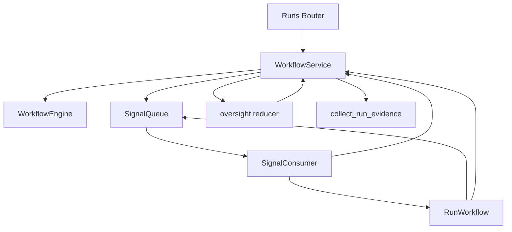
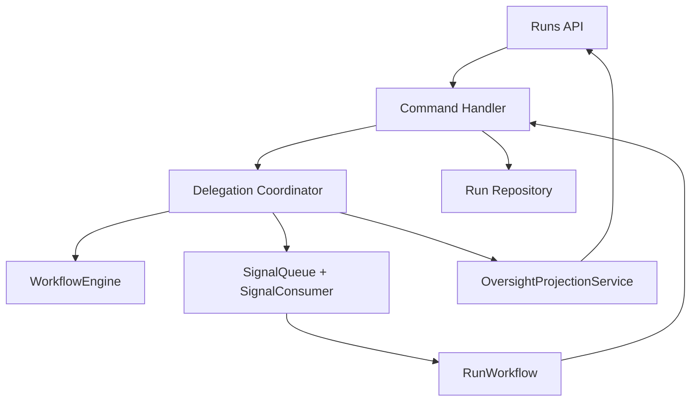

# Super Parent State-Machine Refactor

The parent/child regressions came from mixed policy and state ownership:
task/run transitions live in the engine, while parent control facts were
mutated directly in multiple service paths. The target architecture keeps one
runtime transition machine and adds one explicit delegation coordination layer.

## Current Risk

The execution state machine is real, but parent orchestration was implicit:
create, wait, accept, reject, retry, and aggregate logic could each mutate the
same raw `oversight_state` JSON.

## Target Boundaries

| Layer | Owns | Must not own |
| --- | --- | --- |
| `workflow/engine` | run/task transitions | parent-child policy |
| `workflow/service` | transaction boundary and command dispatch | ad-hoc delegation JSON mutation |
| `workflow/delegation` | delegated work state machine and immutable facts | DB/session I/O |
| `workflow/oversight_projection` | UI/read-model projection | durable control facts |
| `workflow/signals` | signal transport and scheduling | business meaning of child events |

## Delegation Primitive

The reusable abstraction is delegated work, not the Super Parent narrative:

| Concept | Meaning |
| --- | --- |
| `DelegatedWork` | owner, delegate kind, goal, generation, output contract |
| `DelegateCommand` | idempotent command with owner and generation fencing |
| `DelegateResultEnvelope` | terminal result plus validation and artifact manifest |
| `DelegationState` | immutable value object for delegated work, decisions, results, and review states |
| Policy reducer | maps live facts and terminal results to wait, integrate, retry, reject, ask user, or complete |

## Required Guardrails

- Durable coordination facts are edited only through `workflow/delegation` value objects.
- Child execution paths persist child task rows and child lifecycle events only.
- Parent aggregation paths are the only fan-out paths that write delegated-work results.
- Projection fields are computed for reads and are not persisted as control facts.
- Static architecture checks block raw `oversight_state` coordination writes outside the approved boundary.

## Remaining Error Classes

- Engine invariants still raise `InvalidTransitionError` or `GateBlockedError`.
- Evidence and merge problems become explicit review states such as `InvalidEvidence` or `MergeConflict`.
- Duplicate, stale, and out-of-order callbacks become `StaleCommandIgnored` rather than ad-hoc exceptions.
