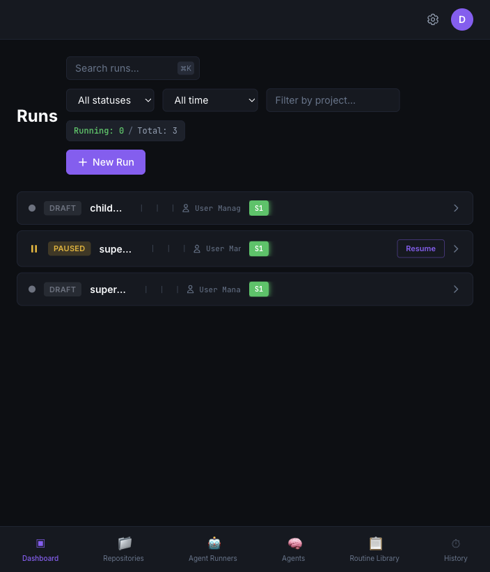
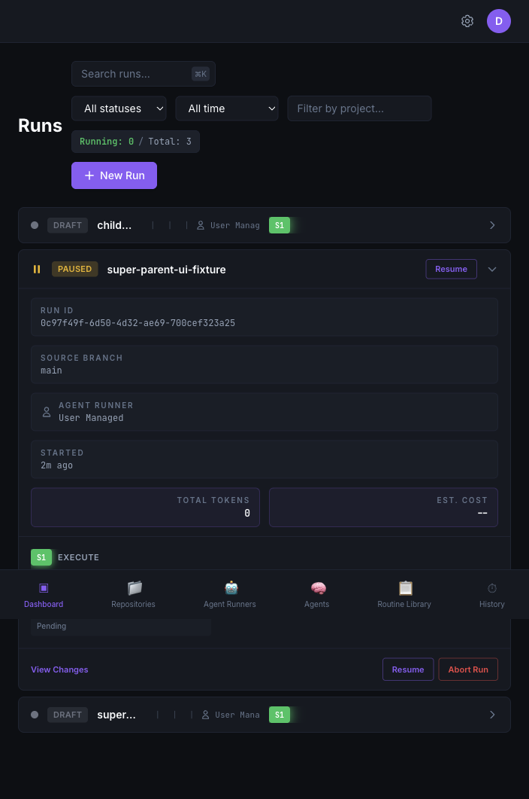
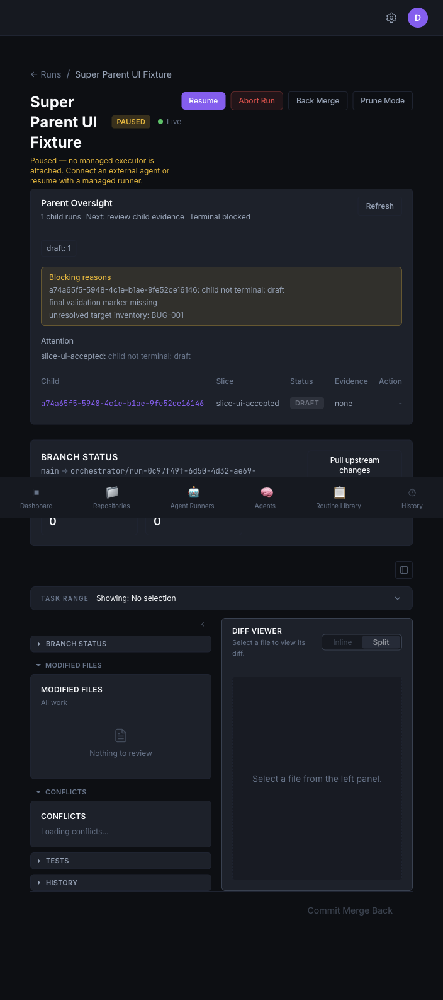
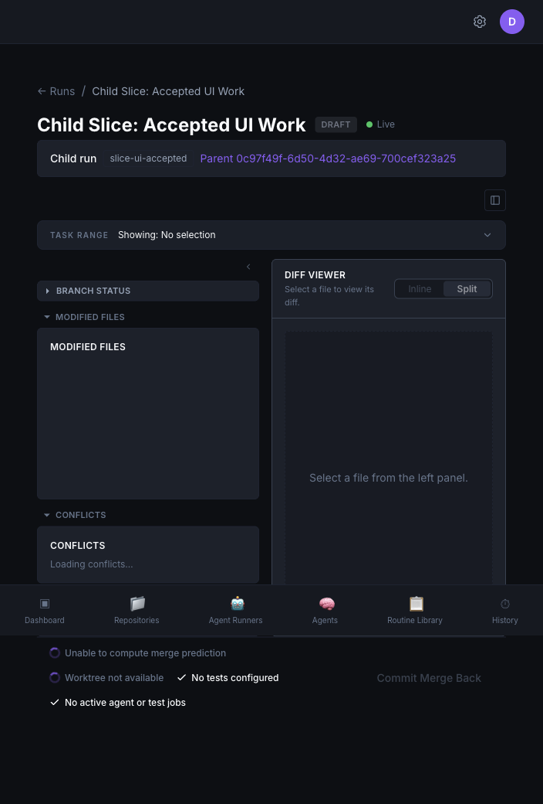

# Current UI

## Dashboard Flat List

What the UI conveys:

- Parent and child runs are shown in the same flat run list.
- A child run reads like a normal top-level run unless the user opens its detail page.
- Status, routine, agent, branch, task progress, cost, and time are visible using the standard run card.
- The dashboard gives no immediate visual grouping for parent/child hierarchy.

What the model has that is not conveyed here:

- `parent_run_id` and `parent_slice_id` are available on child runs.
- Parent runs can carry `oversight_state` with child counts, attention items, terminal blockers, slice attempts, decisions, and target inventory.
- The dashboard filters do not treat oversight attention as "needs input"; they only inspect task pending actions and approval gates.

## Dashboard Parent Expanded

What the UI conveys:

- Expanding a parent run shows the normal run detail card: routine info, branch metadata, task list, progress, and run actions.
- The run appears as a normal paused run after the unmanaged parent runner pauses.
- The expanded dashboard view does not expose the parent oversight summary.

What is missing:

- No child rollup, no hierarchy tree, no next parent action, no terminal guard summary, and no target inventory health.
- No way to distinguish "paused because parent orchestration is waiting for external action" from other pause classes at a dashboard level.

## Parent Detail Oversight

What the UI conveys:

- The detail page includes a dedicated "Parent Oversight" panel when oversight state is present.
- It shows child run count, next parent action, terminal clear/blocked state, child counts, blocking reasons, attention items, and a child summary table.
- The child table includes child run ID, slice ID, run status, evidence outcome, blocking reason, and a contextual action when a child is ready to merge.

What is missing:

- `current_understanding` is not shown, even though it contains the parent summary, recommended next action, ready slices, blocked slices, and required human action.
- `target_inventory` is not shown, so the UI does not explain which bugs, tests, artifacts, or scope items remain unresolved.
- `decisions`, slice history, attempt counts, stalled slices, illegal state reasons, accepted/rejected/abandoned child details, merge conflicts, and final validation are not shown.
- The UI shows up to five blocking reasons and attention items, which is useful for compactness but can hide the full state.
- The panel does not show whether the persisted oversight `parent_status` disagrees with the live run `status`.

## Child Detail

What the UI conveys:

- A child run gets a compact banner that links back to the parent and shows the slice ID.
- The rest of the page uses the normal run detail surface, including task review, diff, comments, and run actions.

What is missing:

- The child page does not explain why this child exists beyond the slice ID.
- It does not show affected inventory items, expected evidence, acceptance criteria inherited from the parent, parent decision context, or whether this child is currently blocking parent completion.
- It does not show the parent-level effect of accepting, rejecting, or abandoning the child.

## Create Run Flow

What the UI conveys:

- Super Parent can be selected through the same Create Run modal used for all routines.
- The user supplies routine inputs and optional JSON config.

What is missing:

- The flow does not become a Super Parent-specific job intake.
- `instruction`, `source_artifacts`, and `max_child_runs` are treated as generic routine inputs rather than a guided parent mission setup.
- There is no source artifact picker, target inventory preview, child budget control, or explanation of what the parent will do next.
